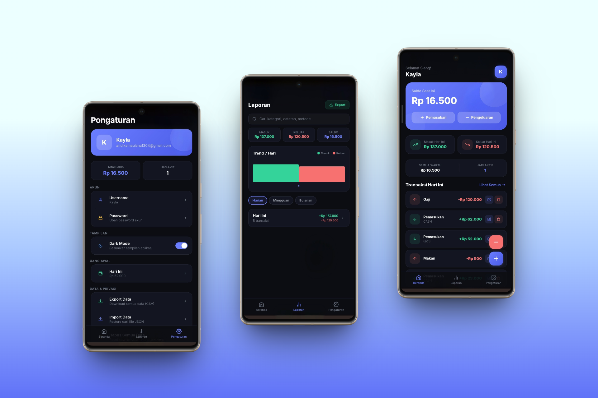

# <p align="center"><br/>Finly</p>

<p align="center">
  
  
  
  
  
</p>

<p align="center">
  <strong>Finly</strong> — aplikasi kas sederhana untuk UMKM mikro, toko kecil, bisnis keluarga, dan penggunaan pribadi.
</p>

<p align="center">
  <strong>🌐 Live:</strong> <a href="https://finly-mauve.vercel.app">finly-mauve.vercel.app</a>
  ·
  <strong>📲 Android:</strong> <a href="https://github.com/Nathan-Liee/Finly/releases/tag/v1.0.4-android">Download APK</a>
</p>

---

## ✨ Fitur

- 🔐 **Multi-user Authentication** — Login via email, data terpisah per pengguna.
- 📥📤 **Pemasukan & Pengeluaran** — Catat arus kas harian dengan kategori dan catatan.
- 💵 **Cash & QRIS** — Tracking metode pembayaran: tunai atau QRIS.
- 💰 **Saldo Awal** — Mulai pencatatan dari saldo awal yang Anda tentukan.
- 📊 **Laporan** — Rekap harian, mingguan, dan bulanan dengan filter rentang tanggal.
- 📁 **Export CSV** — Unduh laporan lengkap dalam format CSV.
- 📈 **Dashboard Analytics** — Ringkasan semua waktu: total masuk, keluar, saldo bersih.
- 💬 **Keluhan & Masukan** — Kirim bug report atau saran fitur langsung dari aplikasi.
- 🔒 **Data Aman** — Row Level Security menjaga data setiap user tetap terpisah.
- 📱 **Responsive** — Nyaman digunakan di desktop maupun mobile.
- 📲 **Android APK** — Tersedia di [GitHub Releases](https://github.com/Nathan-Liee/Finly/releases/tag/v1.0.4-android).

## 📸 Preview

<p align="center">
  
</p>

## 📲 Download Android

APK Android Finly dapat diunduh melalui GitHub Releases:

- [**Download Finly APK**](https://github.com/Nathan-Liee/Finly/releases/download/v1.0.4-android/Finly-v1.0.4-debug.apk) (v1.0.4-debug, 14.85 MB)
- [View Release Page](https://github.com/Nathan-Liee/Finly/releases/tag/v1.0.4-android)

## 💬 Feedback System

Pengguna dapat mengirim laporan bug, keluhan, atau saran fitur melalui form **Keluhan & Masukan** di dalam aplikasi. Feedback tersimpan di Supabase dan ditinjau secara internal oleh developer.

## 🛠️ Tech Stack

| Layer | Teknologi |
|-------|-----------|
| **Frontend** | React, Vite |
| **Backend** | Supabase (PostgreSQL, Auth, RLS) |
| **Mobile** | Capacitor (Android APK) |
| **Deployment** | Vercel |

## 🗄️ Database

Finly menggunakan Supabase PostgreSQL dengan Row Level Security untuk menjaga data setiap user tetap terpisah.

Core tables:
- `profiles` — Data profil user
- `transaksi` — Pemasukan & pengeluaran
- `uang_awal` — Saldo awal per tanggal
- `feedback` — Laporan bug & saran user

## 📦 Instalasi Lokal

```bash
git clone https://github.com/Nathan-Liee/Finly.git
cd Finly
npm install
npm run dev
```

## 🗺️ Roadmap

- [ ] Edit transaksi lintas tanggal
- [ ] Reset transaksi per tanggal
- [ ] Search/filter transaksi lanjutan
- [ ] Offline mode & auto sync improvement
- [ ] UI/UX redesign final
- [ ] Signed Android release build
- [ ] PWA support jika dependency sudah kompatibel

---

<p align="center">
  Dibuat dengan ❤️ untuk manajemen keuangan yang lebih baik.
</p>
